<!-- Mermaid pitfalls (so you don't have to debug them again):
     - Timeline: colons in labels (e.g. "00:00") break parsing because ":"
       is the delimiter.  Use "0 sec", "2 sec" etc. instead.
     - Gantt + dateFormat X: "after taskId, 200" treats 200 as an absolute
       timestamp, not a duration.  Use explicit start/end: "taskId, 800, 1000".
     - Run `make lint-mermaid` to catch syntax errors before committing.  -->

# How It Works

ty-find is built as a three-layer system: a thin **CLI client**, a persistent **background daemon**, and the **ty LSP server** that does the actual Python analysis. This page explains how they fit together and why.

## Architecture overview

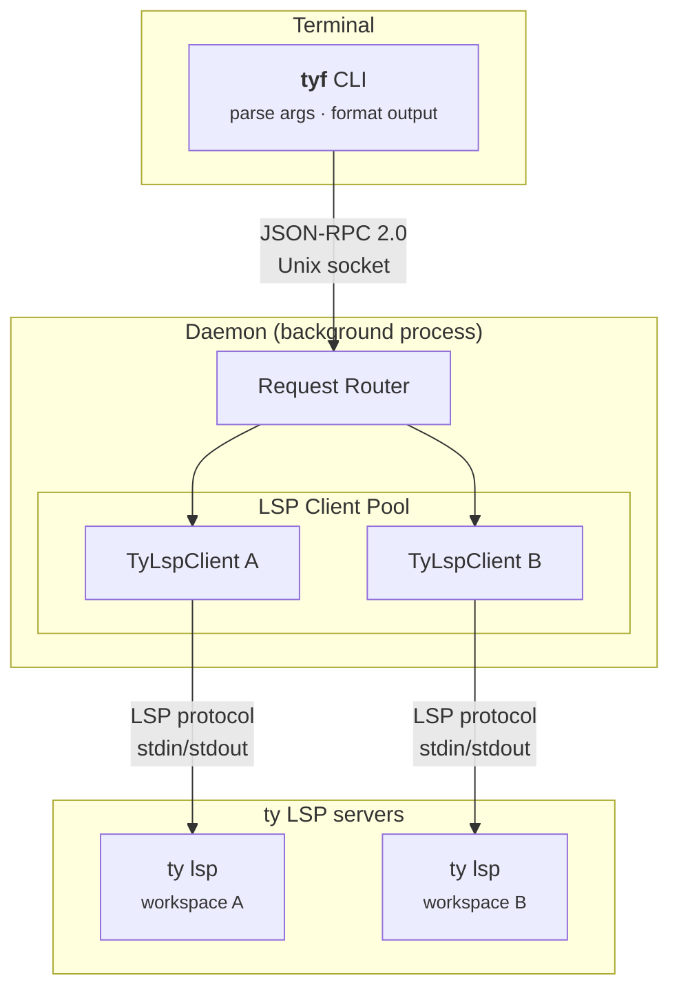

Each layer has a single responsibility:

| Layer | Responsibility |
|-------|----------------|
| **CLI** (`tyf`) | Parse arguments, connect to daemon, format output |
| **Daemon** | Keep LSP servers alive between calls, route requests |
| **ty LSP** | Python type analysis, symbol resolution, indexing |

## Request lifecycle

Here's what happens when you run `tyf find calculate_sum`:

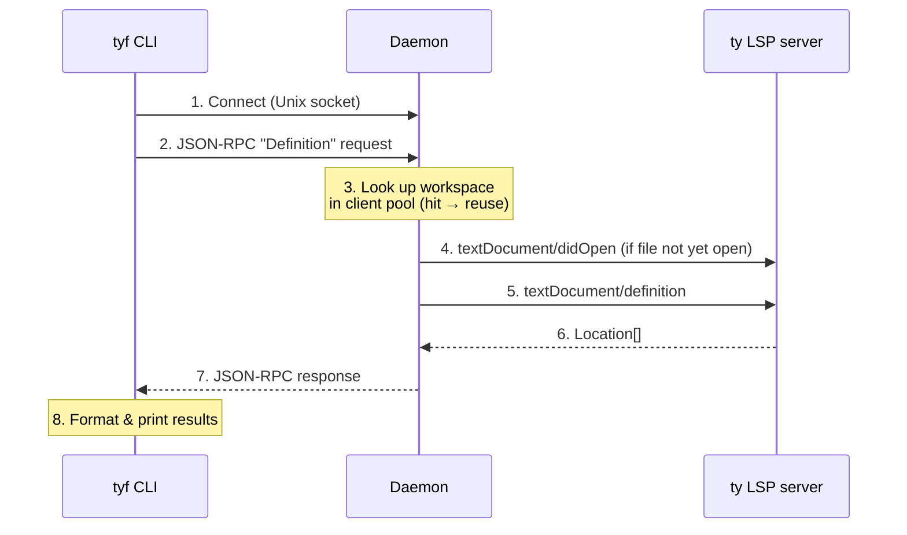

Steps 1–8 take **50–100 ms** on a warm daemon. Without the daemon, every call would pay the full LSP startup cost (several seconds).

## The daemon

The daemon is a long-running background process that listens on a Unix domain socket at `/tmp/ty-find-{uid}.sock`. It starts automatically on first use and shuts itself down after 5 minutes of inactivity.

### Why a daemon?

Starting an LSP server is expensive. The ty LSP process needs to:

1. Spawn and initialize
2. Index the Python project (parse files, resolve imports, build type information)
3. Reach a "ready" state where it can answer queries

This takes **1–5 seconds** depending on project size. The daemon pays this cost once and keeps the server running for subsequent calls.

```mermaid
gantt
    title Without daemon — cold start every time
    dateFormat X
    axisFormat %s

    section tyf find foo
    spawn ty lsp     :a1, 0, 800
    LSP initialize   :a2, 800, 1000
    index project    :a3, 1000, 3000
    LSP query        :a4, 3000, 3050
    format output    :a5, 3050, 3060

    section tyf find bar
    spawn ty lsp     :b1, 3060, 3860
    LSP initialize   :b2, 3860, 4060
    index project    :b3, 4060, 6060
    LSP query        :b4, 6060, 6110
    format output    :b5, 6110, 6120
```

```mermaid
gantt
    title With daemon — warm after first call
    dateFormat X
    axisFormat %s

    section tyf find foo
    connect to daemon :a1, 0, 20
    send request      :a2, 20, 30
    LSP query         :a3, 30, 430
    format output     :a4, 430, 440

    section tyf find bar
    connect to daemon :b1, 440, 460
    send request      :b2, 460, 470
    LSP query         :b3, 470, 900
    format output     :b4, 900, 910
```

### Auto-start and version checking

The CLI automatically manages the daemon lifecycle:

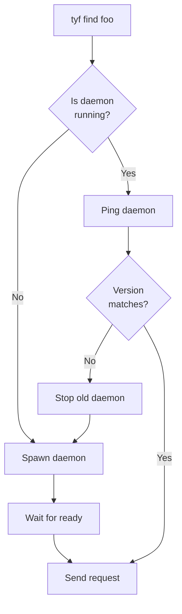

When you upgrade ty-find, the CLI detects that the running daemon is from an older version and restarts it automatically.

### Idle shutdown

The daemon tracks activity at two levels:

- **Per-workspace**: Each LSP client records its last access time. Clients idle for more than 5 minutes are cleaned up (the `ty lsp` process is terminated).
- **Daemon-wide**: If all workspace clients are idle, the daemon shuts itself down.

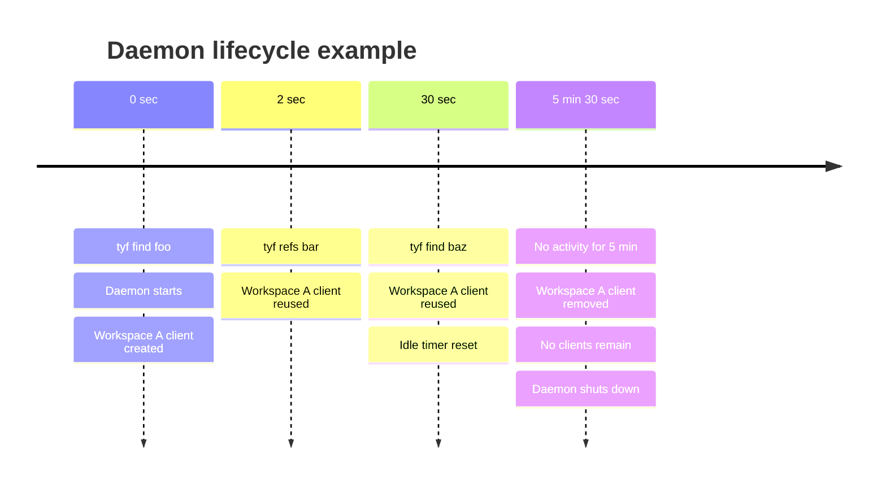

## LSP client pool

The daemon maintains a pool of LSP clients, one per workspace. When a request arrives, the daemon resolves it to a workspace root and looks up the corresponding client.

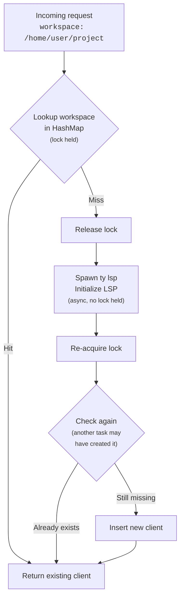

The pool uses a **lock-free fast path** pattern: the `std::sync::Mutex` is held only for the HashMap lookup (microseconds), then dropped before any async work. This avoids holding a lock across `.await`, which would block other tasks.

## Communication protocols

### CLI ↔ Daemon: JSON-RPC 2.0 over Unix socket

The CLI and daemon communicate using JSON-RPC 2.0 with LSP-style message framing:

```
Content-Length: 128\r\n
\r\n
{"jsonrpc":"2.0","id":1,"method":"Definition","params":{...}}
```

Available RPC methods:

| Method | Description |
|--------|-------------|
| `Ping` | Health check (returns version and uptime) |
| `Shutdown` | Gracefully stop the daemon |
| `Definition` | Go to definition of a symbol at a position |
| `Hover` | Get type information for a symbol at a position |
| `References` | Find all references to a symbol |
| `BatchReferences` | Find references for multiple symbols in one call |
| `WorkspaceSymbols` | Search for symbols by name across the workspace |
| `DocumentSymbols` | List all symbols in a file |
| `Inspect` | Combined definition + hover + references |
| `Members` | Public interface of a class |
| `Diagnostics` | Type errors in a file |

### Daemon ↔ ty LSP: LSP protocol over stdin/stdout

The daemon communicates with each `ty lsp` process using the standard [Language Server Protocol](https://microsoft.github.io/language-server-protocol/). Messages use the same `Content-Length` framing but carry standard LSP methods like `textDocument/definition` and `textDocument/hover`.

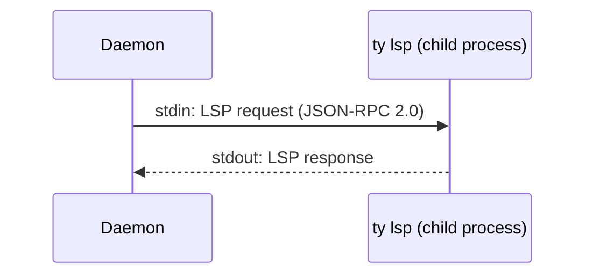

Response routing works through request IDs: each outgoing request gets a unique integer ID (from an `AtomicU64`). A background task reads responses from stdout and matches them to pending requests using a `HashMap<u64, oneshot::Sender>`.

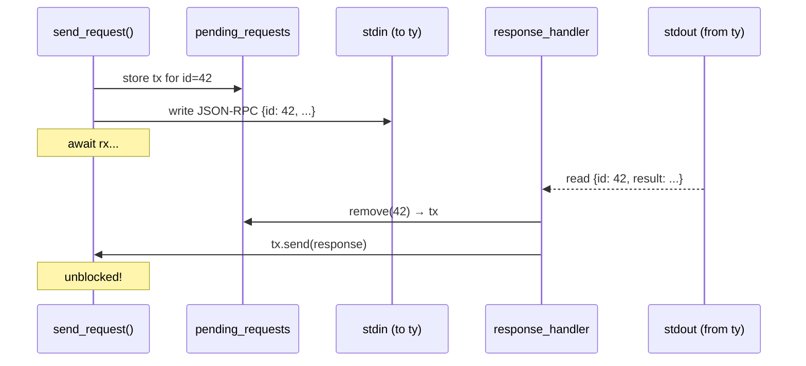

## Concurrency model

All parallelism is handled by the daemon, not the CLI:

- The LSP protocol runs over a single stdin/stdout pipe per server, so requests are inherently sequential.
- Multi-symbol operations (like `tyf inspect A B C`) are sent as a single batch RPC call. The daemon processes them sequentially on its LSP client and returns merged results.
- The CLI never spawns multiple connections or concurrent requests. This keeps the architecture simple and avoids race conditions.

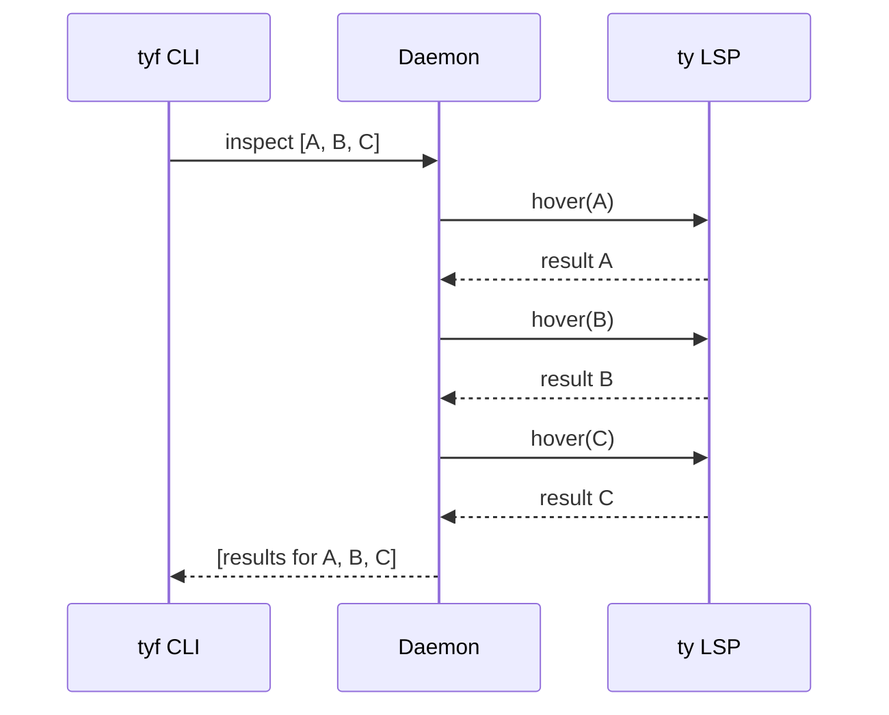

## Document tracking

The LSP protocol requires that a client sends `textDocument/didOpen` before querying a file, and only sends it once per file per session. The LSP client tracks opened documents in a `HashSet<String>`:

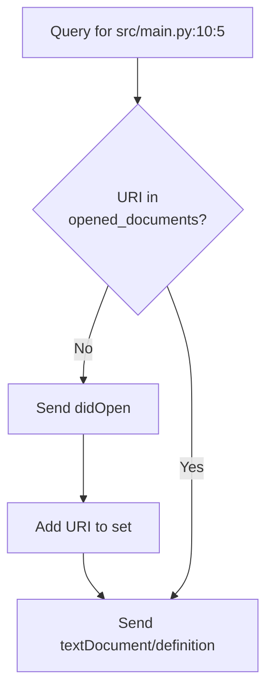

Sending a duplicate `didOpen` would cause the LSP server to re-analyze the file, returning null results during the re-analysis window. The tracking set prevents this.

## Warmup and retries

On a cold start, the LSP server may not be fully ready to answer queries even after initialization completes. The daemon handles this with automatic retries:

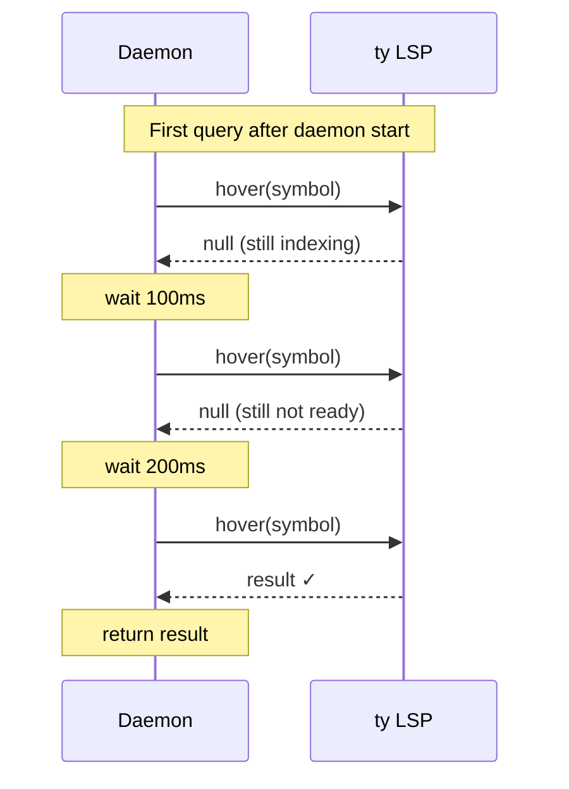

Retries use exponential backoff (200ms, 400ms, 800ms, 1600ms) and apply to all operations that can return empty or null results during warmup, including `hover`, `workspace/symbol`, `definition`, `references`, and `documentSymbol`.
